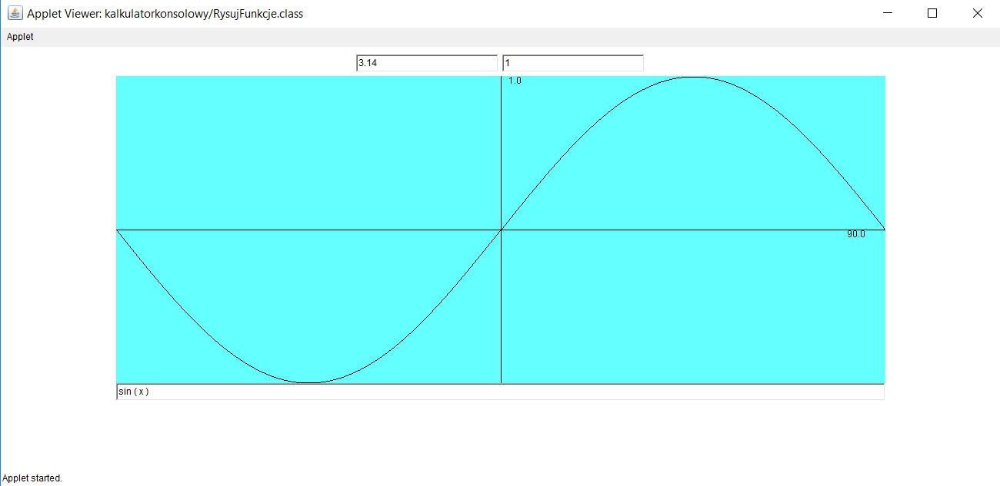

# projekty2
Projekt wykorzystujący algorytm shunting yard, do rysowania funkcji. Dolny textfield pobiera od użytkownika funkcje, a górne zakresy y i x.
Następnie funkcja zostaje narysowana na canvasie. Program działa dla podstawowych funkcji i radzi sobie z nawiasami i kolejnością działań
dzięki wykorzystaniu algorytmu shunting yard.

Sin(x) narysowany dla zakresu x od -3.14 do 3.14 i zakresu y od -1 do 1

Funkcja kwadratowa opisana za pomocą nawiasów, narysowana dla przedziałów x od -2 do 2 i y od -4 do 4
